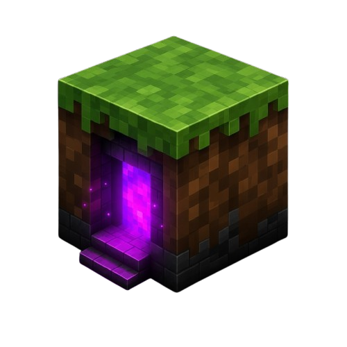
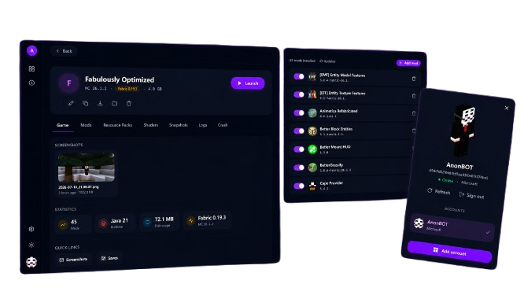
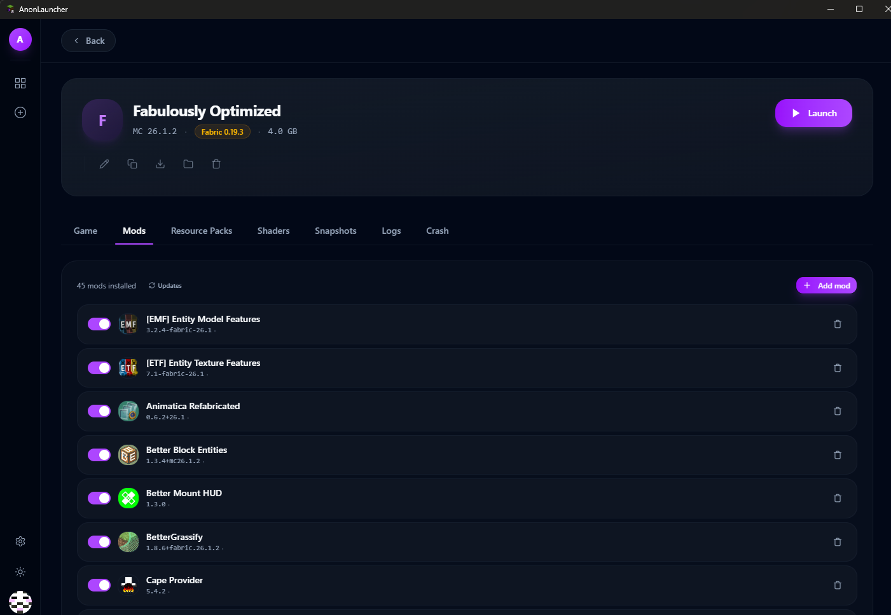
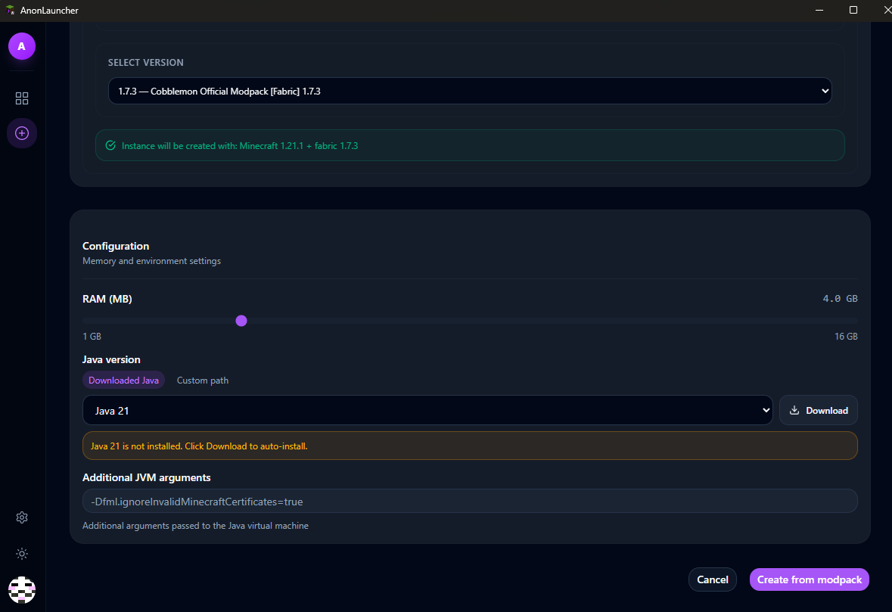

<div align="center">



# AnonLauncher

**Nowoczesny, lekki launcher Minecraft**


[🌐 Strona](https://anonbotpl.github.io/Anon-Launcher/) · [📦 Wydania](https://github.com/AnonBOTpl/Anon-Launcher/releases) · [🇬🇧 English](README.md)

</div>

---



---

## Funkcje

- 🗂️ **Wiele instancji** — twórz, klonuj, eksportuj i importuj instancje jako ZIP
- 🧩 **Vanilla · Fabric · NeoForge** — pełne wsparcie loaderów z auto-instalacją
- 🔧 **Zarządzanie modami** — wyszukuj, instaluj, aktualizuj i usuwaj mody przez Modrinth
- 📦 **Instalacja modpacków** — jeden klik dla `.mrpack` z Modrinth lub URL
- 🖼️ **Resource packi i Shadery** — przeglądaj i instaluj bezpośrednio z Modrinth
- ☕ **Auto Java** — automatycznie pobiera odpowiednią wersję JRE (Java 8–25)
- 🔐 **Logowanie Microsoft** — Device Code Flow z szyfrowanym przechowywaniem tokenów
- 👥 **Wiele kont** — przełączaj między wieloma kontami Microsoft
- 📸 **Snapshoty** — pełne lub tylko metadanych kopie zapasowe przed aktualizacją modów
- 🎨 **Kolory akcentu** — 8 presetów kolorów, motyw ciemny/jasny
- 🌍 **i18n** — angielski, polski, niemiecki, japoński, francuski, hiszpański
- 🔔 **Auto-update** — sprawdza GitHub Releases przy każdym uruchomieniu

---

## Screenshoty

| Zarządzanie modami | Instalacja modpacka |
|:---:|:---:|
|  |  |

---

## Instalacja

Pobierz najnowszy instalator Windows z [Wydań](https://github.com/AnonBOTpl/Anon-Launcher/releases/latest).

> Linux i macOS: buduj ze źródeł (patrz niżej).

---

## Budowanie ze źródeł

```bash
git clone https://github.com/AnonBOTpl/Anon-Launcher.git
cd Anon-Launcher
npm install
npm run tauri dev       # tryb deweloperski
npm run tauri build     # wersja produkcyjna
```

**Wymagania:** Node.js ≥ 18 · Rust ≥ 1.70 · npm ≥ 9

---

## Stack technologiczny

[Tauri v2](https://tauri.app) · [React 19](https://react.dev) · [TypeScript](https://www.typescriptlang.org) · [Rust](https://www.rust-lang.org) · [shadcn/ui](https://ui.shadcn.com) · [Tailwind CSS v4](https://tailwindcss.com)

---

## Licencja

[AGPL-3.0](LICENSE) · [Polityka prywatności](PRIVACY.md) · [Contributing](CONTRIBUTING.md)

---

<div align="center">
Stworzone przez <a href="https://github.com/AnonBOTpl">AnonBOTpl</a>
</div>
